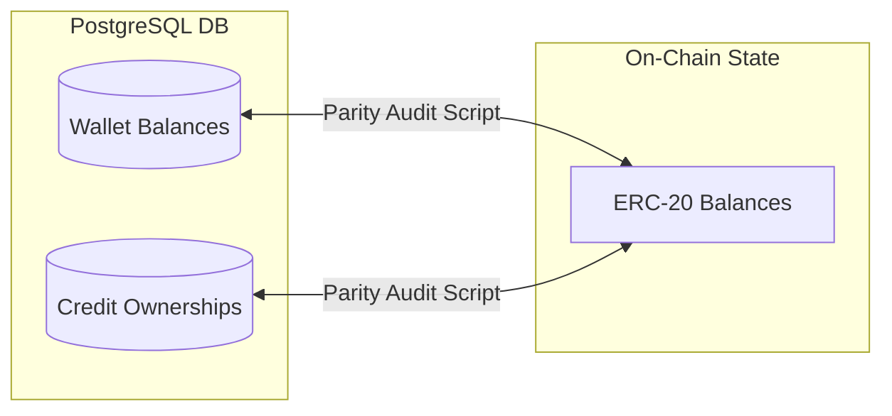

# Blockchain System Context: Carbon MRV Platform

## 1. Smart Contract Architecture

The core of our tokenization system is `CarbonCreditToken.sol` (an ERC-20 compliant token contract). 

### Key Properties
- **Name**: `Carbon MRV Credit`
- **Symbol**: `CMRV`
- **Decimals**: `18` (standard ERC-20, though the platform uses raw integer scaling where 1 unit = 1 token/credit).

---

## 2. Core Operational Functions

### 2.1 Minter Authorization
The contract owner (the platform treasury) authorizes minter addresses:
```solidity
function approveMinter(address minter) external onlyOwner;
function revokeMinter(address minter) external onlyOwner;
```

### 2.2 Credit Minting (`mintCredits`)
Triggered when an approved project undergoes issuance:
```solidity
function mintCredits(address recipient, uint256 amount, string memory projectId) external onlyMinter;
```
- **Restriction**: Restricted to minters/owner.
- **Action**: Mints tokens directly to the farmer's wallet address.
- **Event**: Emits `CreditsMinted(recipient, amount, projectId)`.

### 2.3 Carbon Offset Retirement (`retireCredits` & `adminRetire`)
Burning tokens to offset carbon footprints:
```solidity
function retireCredits(uint256 amount, string memory reason) external;
function adminRetire(address account, uint256 amount, string memory reason) external onlyOwner;
```
- **Action**: Burns tokens from the caller's balance or the target user's balance.
- **Record**: Appends a `RetirementRecord` containing amount, reason, and block timestamp to the user's history.
- **Event**: Emits `CreditsRetired(account, amount, reason)`.

### 2.4 Administrative Transfer (`adminTransfer`)
Enables gasless operations for Web2-based buyers (such as credit card checkout):
```solidity
function adminTransfer(address from, address to, uint256 amount) external onlyOwner;
```
- **Action**: Moves tokens from the farmer's wallet to the buyer's wallet on their behalf.
- **Event**: Emits `AdminTransferred(from, to, amount)`.

---

## 3. Database & Ledger Parity Sync Logic
To maintain strict accountability, we track balances across both the PostgreSQL database (`CreditOwnership` and `Wallet` tables) and the blockchain.



If a transaction occurs on-chain (e.g. outside the app shell) or a database transaction fails to commit, the **Parity Audit Daemon** flags the discrepancy:
1. Queries the RPC provider for `balanceOf(user_wallet_address)`.
2. Queries the DB for the user's internal wallet balance.
3. If they differ, the admin panel highlights the account as "De-synchronized" and allows manual ledger correction.
