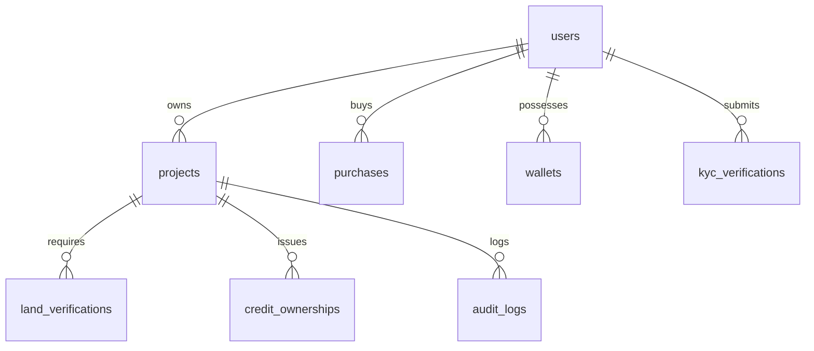

# Database Schema Overview

This document describes the PostgreSQL database schema used by the Carbon MRV Platform.

---

## 1. Entity Relationship Overview

The schema is built on top of SQLAlchemy models, structured in PostgreSQL.

---

## 2. Table Schemas & Column Details

### 2.1 `users`
Represents platform participants.
- **id**: `UUID` (Primary Key)
- **full_name**: `String`
- **email**: `String` (Unique, Indexed)
- **password_hash**: `String`
- **role**: `String` (Enum: `farmer`, `ngo`, `nco`, `auditor`, `company`, `admin`)
- **wallet_address**: `String` (Unique, Nullable)
- **wallet_verified**: `Boolean` (Default: `False`)
- **kyc_completed**: `Boolean` (Default: `False`)

### 2.2 `projects`
Represents land carbon assets.
- **id**: `UUID` (Primary Key)
- **owner_id**: `UUID` (Foreign Key to `users.id`)
- **project_name**: `String`
- **project_type**: `String`
- **location**: `String`
- **country**: `String`
- **latitude**: `Float`
- **longitude**: `Float`
- **polygon_coordinates**: `String` (GeoJSON or coordinate lists)
- **land_area_acres**: `Float`
- **ndvi_score**: `Float` (From Sentinel-2)
- **vegetation_health**: `Float` (From Sentinel-2)
- **fraud_risk_score**: `Float` (Predicted by ML Classifier)
- **agb_per_hectare**: `Float` (Above-ground biomass per hectare predicted by ML)
- **total_biomass**: `Float` (AGB * Hectares)
- **carbon_stock**: `Float` (Biomass * 0.47)
- **co2e**: `Float` (Carbon * 3.6667)
- **estimated_credits**: `Integer` (Calculated whole tons of CO2e)
- **credits_available**: `Float` (Remaining marketplace inventory)
- **credits_sold**: `Float` (Purchased inventory)
- **status**: `String` (Enum: `draft`, `active`, `suspended`)
- **audit_status**: `String` (Enum: `pending`, `approved`, `rejected`)
- **lifecycle_status**: `String` (Enum: `submitted`, `verified_pending_audit`, `approved_pending_credit_issue`, `tokenized`)
- **blockchain_tx_hash**: `String` (Nullable)
- **tokenized**: `Boolean` (Default: `False`)

### 2.3 `wallets`
Stores virtual wallet information synchronizing with local/on-chain states.
- **id**: `UUID` (Primary Key)
- **user_id**: `UUID` (Foreign Key to `users.id`, Unique)
- **address**: `String`
- **balance**: `Float` (Default: `0.0`)
- **locked_balance**: `Float` (Default: `0.0`)

### 2.4 `credit_ownerships`
Tracks ledger ownership mapping credit counts.
- **id**: `UUID` (Primary Key)
- **owner_id**: `UUID` (Foreign Key to `users.id`)
- **project_id**: `UUID` (Foreign Key to `projects.id`)
- **total_credits_owned**: `Float` (Standard tons of CO2e)

### 2.5 `kyc_verifications`
- **id**: `UUID` (Primary Key)
- **user_id**: `UUID` (Foreign Key to `users.id`)
- **document_path**: `String` (Supabase storage destination path)
- **status**: `String` (Enum: `pending`, `approved`, `rejected`)
- **notes**: `String`
