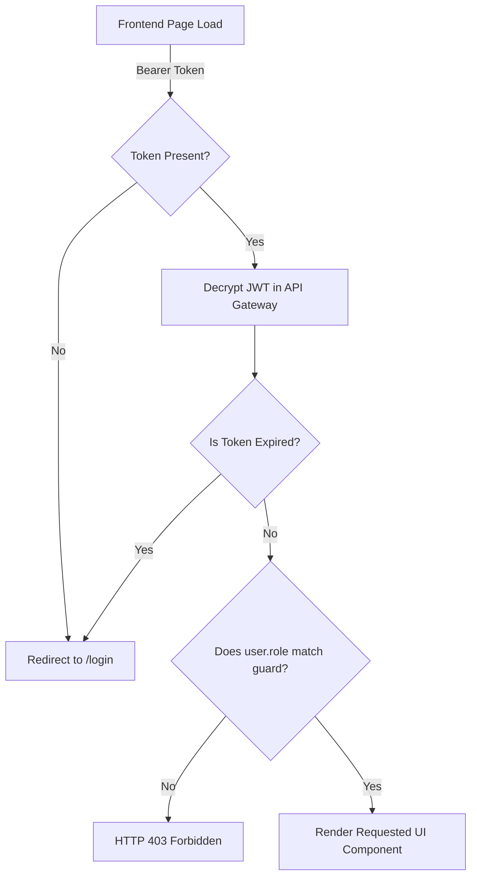

# Frontend-Backend Integration Map

This document maps user interface routes and dashboards to the backend REST API endpoints.

---

## 1. Route Map & API Bindings

| Frontend Page / Route | Role Access | Primary Backend API Call | Action |
| :--- | :--- | :--- | :--- |
| `/login` | Public | `POST /api/auth/login` | Yields JWT bearer token. |
| `/register` | Public | `POST /api/auth/register` | Creates a new user record. |
| `/dashboard/farmer` | Farmer | `GET /api/projects/` | Lists farmer-owned projects. |
| `/dashboard/farmer/submit` | Farmer | `POST /api/projects/` | Submits a project boundary. |
| `/dashboard/farmer/document` | Farmer | `POST /api/land-verification/{project_id}/upload` | Uploads ownership proof. |
| `/dashboard/auditor` | Auditor | `GET /api/auditor/projects/pending` | Lists projects waiting audit. |
| `/dashboard/auditor/compliance` | Auditor | `GET /api/auditor/document/serve` | Serves secure KYC/Land PDFs. |
| `/dashboard/auditor/verify` | Auditor | `POST /api/auditor/projects/{project_id}/verify` | Approves or rejects project. |
| `/dashboard/admin/mint` | Admin | `POST /api/blockchain/mint` | Issues tokens to farmer. |
| `/marketplace` | Company | `GET /api/marketplace/` | Lists available inventory. |
| `/marketplace/purchase` | Company | `POST /api/marketplace/orders` | Processes a token purchase. |
| `/wallet` | All Roles | `GET /api/blockchain/wallet/{wallet_address}` | Displays token balance. |
| `/retirement` | Company | `POST /api/blockchain/retire` | Burns credits and issues certificate. |

---

## 2. Authentication Flow & Role Guards
Authentication is handled via JWT bearer tokens stored in browser cookies or LocalStorage.



### Backend Guards (FastAPI)
Routes are protected using dependencies:
```python
current_user: User = Depends(get_current_user)
current_auditor: User = Depends(require_role(["auditor", "admin"]))
```
If the user's role does not match, FastAPI raises a `403 Forbidden` exception, which the Next.js fetch interceptor catches to display an access denied message.
