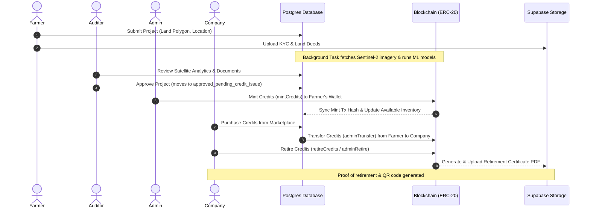

# Master Project Context: Carbon MRV Platform

## 1. Project Purpose & Climate-Tech Goals
The Carbon MRV (Measurement, Reporting, and Verification) Platform is an enterprise-grade web3-enabled software ecosystem designed to bring mathematical rigor, transparency, and trust to the Voluntary Carbon Market (VCM). By replacing manual spreadsheets, subjective audits, and double-counting loopholes with decentralized ledger technology (DLT) and automated Machine Learning (ML) geospatial models, the platform tokenizes verified carbon offsets.

### Core Goals
- **Mitigate Greenwashing**: Eliminate simulated or fictitious carbon credit issuance through verified satellite data pipelines.
- **Enforce Parity**: Guarantee that 1 Token always equals exactly 1 Metric Ton of Carbon Dioxide Equivalent ($CO_2e$) removed or sequestered.
- **De-friction Carbon Markets**: Provide automated onboarding, verification, and settlement for local farmers and global buyers without excessive third-party overhead.

---

## 2. The MRV Workflow
The platform operates on a multi-stage Measurement, Reporting, and Verification lifecycle:

1. **Measurement**: Lands are mapped using polygon coordinates. Multispectral bands are extracted from Sentinel-2 imagery (Red, NIR, SWIR).
2. **Reporting**: Biomass values (AGB/ha), carbon stock (tons), and estimated $CO_2e$ yields are automatically generated.
3. **Verification**: Automated fraud scoring is run to check for duplicate boundaries, urban development, or water body overlap. Finally, an authorized auditor verifies documents, KYC status, and geospatial reports.

---

## 3. Blockchain & ESG Marketplace Role
- **Immutable Ledger**: Every minted credit is tied to an ERC-20 token (`CMRV`) representing a unique project ID. Transactions, transfers, and retirements are permanently recorded on-chain.
- **Decentralized Treasury**: Controls contract ownership, ensuring only verified platform transactions can mint or transfer credits.
- **Marketplace Liquidity**: Disintermediates carbon trading. Companies buy credits directly from farmers using web2 gateways (e.g. Razorpay) or crypto wallets, and retire them on-chain.

---

## 4. User Roles and Treasury Governance
The system restricts operations using role-based guards:

| Role | Permissions & Responsibilities |
| :--- | :--- |
| **Farmer** | Registers land polygons, uploads land ownership/KYC documents, and requests verification. |
| **Auditor** | Inspects KYC/land deeds, audits satellite indices/ML metrics, flags fraud anomalies, and approves projects. |
| **Admin (Treasury)** | Oversees registry, sets prices, issues (mints) credits to farmers, and controls system variables. |
| **Company (Buyer)** | Purchases credits on the marketplace, receives ESG certificates, and retires/burns credits. |

---

## 5. Full Lifecycle Sequence Diagram
Below is the operational journey of a carbon credit:

