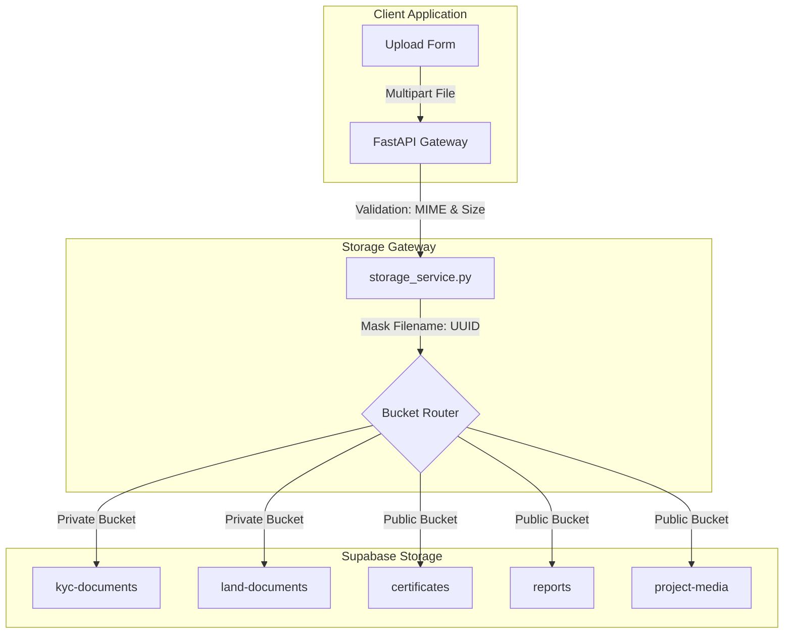

# Storage & Upload System Context

## 1. Storage Architecture: Supabase Integration
The Carbon MRV Platform has migrated away from local disk storage and third-party media APIs to integrate directly with **Supabase Storage**.

---

## 2. Bucket Permissions & RLS Policies

### 2.1 Private Buckets (`kyc-documents`, `land-documents`)
- **Accessibility**: Read access is completely restricted to anonymous requests.
- **Auditor Retrieval**: To preview a document, the Auditor calls `/api/auditor/document/serve`. The backend generates a **signed URL** valid for 15 minutes using the Supabase `service_role` key and returns a `307 Temporary Redirect` response.

### 2.2 Public Buckets (`certificates`, `reports`, `project-media`)
- **Accessibility**: Readable publicly.
- **Upload**: Restricted to backend calls signed with the service role key.
- **Usage**: Serving carbon offset certificates and PDF analytics reports directly.

---

## 3. Security, MIME & Size Verification

To prevent malicious uploads, `storage_service.py` enforces strict filters:
1. **Size Verification**: Max size is 10 MB.
2. **MIME Verification**:
   - Documents (`pdf`, `doc`, `docx`): Allowed only in `kyc-documents` and `land-documents`.
   - Images (`png`, `jpg`, `jpeg`, `webp`): Allowed in `project-media`.
3. **Filename Masking**: Original filenames are discarded. Files are renamed using unique UUIDs (e.g. `document.pdf` becomes `e4b3c2a1-0012-4fab-9012-bcde89234fa1.pdf`) to prevent directory traversal or ID leakage.

---

## 4. Code Architecture & Service Layer
- **`app/services/storage_service.py`**: Handles direct client operations, file uploads, file downloads, bucket provisioning, and signed URL generation.
- **`app/services/certificate_generator.py`** & **`app/services/certificate_service.py`**: Assemble PDFs locally using ReportLab, upload them to `certificates/`, and immediately delete the local temporary file.
- **`app/api/reports.py`**: Assembles sustainability and biomass reports, uploads them to `reports/`, and redirects the client to the public URL.
