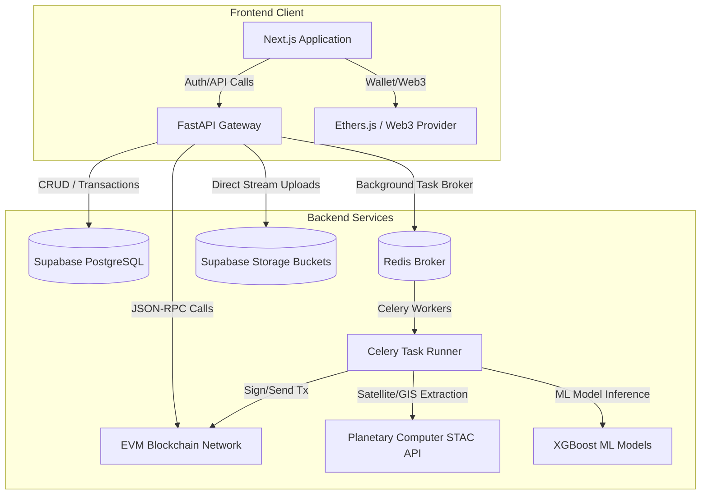

# System Architecture: Carbon MRV Platform

## 1. High-Level Component Block Diagram
The Carbon MRV Platform is composed of a decoupled front-end and back-end architecture integrated with Supabase postgres and storage, a Celery task queue, and local/testnet EVM blockchains.

---

## 2. Technology Stack Details

### Frontend
- **Framework**: Next.js (TypeScript)
- **Styling**: Vanilla CSS with dark mode elements.
- **Web3 Integration**: Ethers.js, connecting to MetaMask or other browser extension providers.

### Backend Gateway
- **Framework**: FastAPI (Python)
- **ASGI Server**: Uvicorn
- **ORM**: SQLAlchemy

### Task Queue & Storage
- **Queue Manager**: Celery
- **Message Broker**: Redis
- **Database**: Supabase PostgreSQL
- **File System**: Supabase Storage Buckets (both Private and Public)

### Cryptographic Infrastructure
- **Network**: Hardhat (for local validation) and Polygon Amoy (for staging/testnet)
- **Contract Language**: Solidity ^0.8.24
- **Web3 Interface**: Web3.py (with deferred import architectures to optimize start times)

---

## 3. Core Data Flow Routes

### 3.1 Project Lifecycle & Verification Flow
1. **API Post**: `/api/projects/` initiates a project record in `submitted` state.
2. **CELERY Trigger**: A background task (`verify_project_task`) is spawned.
3. **External Fetch**: STAC client queries Microsoft Planetary Computer for cloud-free Sentinel-2 L2A rasters.
4. **Spectral Processing**: Raster bands are masked to the polygon geometry, extracting Red, NIR, and SWIR pixel arrays.
5. **ML Prediction**: Pixels are fed to the XGBoost regression (`carbon_model.pkl`) and classification (`fraud_model.pkl`) models.
6. **DB Parity**: Results are synced back to the Postgres database, modifying `ndvi_score`, `total_biomass`, `co2e`, `estimated_credits`, and `fraud_risk_score`.

### 3.2 Credit Tokenization Flow
1. **Auditor Action**: Calls `/api/auditor/projects/{project_id}/verify` with status `approved`.
2. **Admin Command**: Calls `/api/blockchain/mint` or triggers `/api/projects/{project_id}/mint-credits`.
3. **Transaction Broadcast**: Back-end signs a `mintCredits` transaction using `MASTER_WALLET_PRIVATE_KEY` and broadcasts it to the RPC node.
4. **Database Sync**: Celery worker listens for the transaction receipt, marks `project.tokenized = True`, copies the transaction hash to the database, and adds the balance to the farmer's internal wallet.
